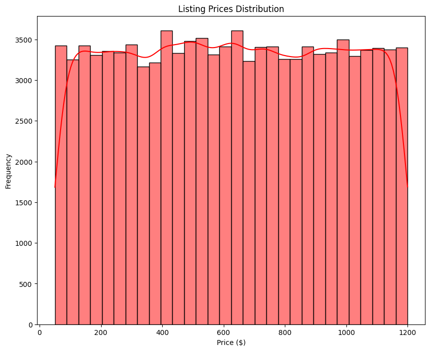
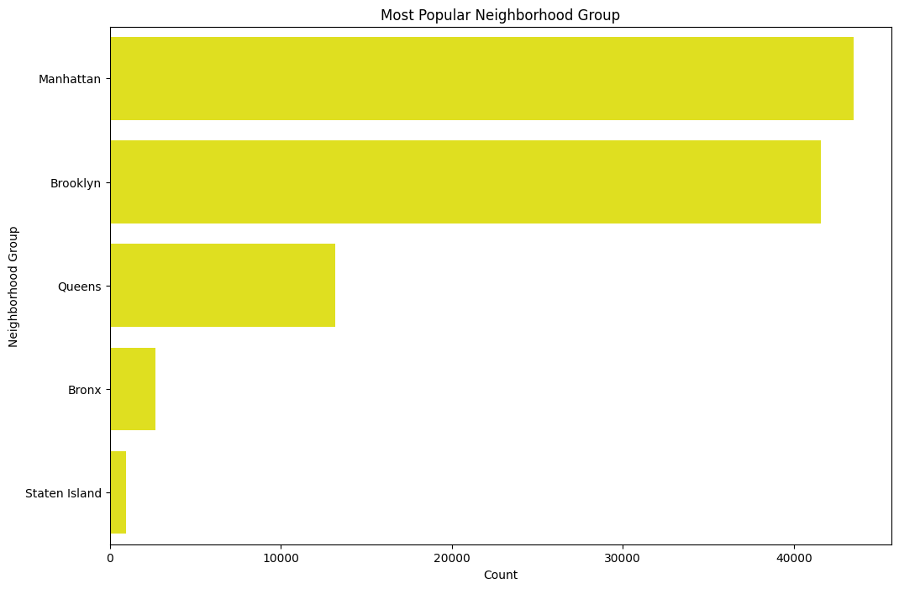
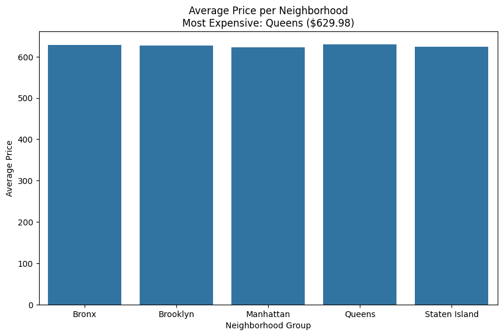
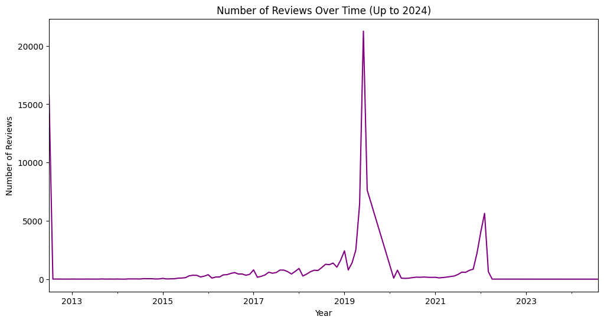

# Airbnb-EDA
EDA on an AirBnB booking dataset to reveal the insights and trends

## Project Overview
This project focuses on analyzing Airbnb listing data to explore pricing distributions, listing concentrations across boroughs, average pricing trends, and review patterns.
The goal is to better understand the Airbnb market landscape through data-driven insights.

## DataSet
* Features include: listing price, borough location, room type, number of reviews, and availability.

## Data Cleaning Process

### Handled Missing Values:
* Checked for columns with null values and addressed them appropriately (e.g., dropping or imputing where necessary).
* Dropped records with missing 'name' or 'host name'.
* Filled missing 'reviews per month' with 0.
* Converted 'last review' to datetime format; missing dates were filled with the earliest review date.

### Removed Irrelevant Columns:
Dropped the country code column since all listings were exclusively based in New York City, making the column redundant.

### Data Type Cleaning:
* Removed dollar signs ($) from 'price' and 'service fee' columns and converted them to numeric (float) types for analysis.

### Removed Duplicates:
* Identified and dropped duplicate rows to ensure data integrity.

### Saved Cleaned Data:
* Exported the cleaned dataset to a new CSV file (cleaned_airbnb_data.csv) for further analysis.

## Key Insights

### Price Distribution

This graph suggests that the Airbnb market in New York (based on this data) offers a diverse range of price options for travelers, without a strong concentration at any single price point. There are slightly more listings available in certain price bands, which could reflect common price points for different types or tiers of accommodations.

### Listing Distribution by Borough:

This chart highlights a significant concentration of Airbnb listings in Manhattan, followed by Brooklyn. Queens has a moderate number, while the Bronx and Staten Island have a relatively small share of the Airbnb market within this dataset. For potential hosts this data can help with identifying areas with potentially higher demand or less competition.

### Priciest Borough by Average Price:

The most significant finding from this chart is that Queens has the highest average price for Airbnb listings among the five boroughs presented in this dataset. The other boroughs have average prices that are notably lower and quite similar to each other.

### Review Trends:

This line graph highlights some key observations

* Initial Low Activity (2013-2015): The number of reviews starts at a relatively low level in 2013 and remains low with minor fluctuations until around 2015. This suggests that the platform or the collection of data might have been in its early stages during this period, with fewer users leaving reviews.

* Gradual Increase (2015-Early 2019): From 2015 to early 2019, there is a noticeable upward trend in the number of reviews. While there are some dips and rises, the overall trajectory is increasing. This indicates a growing activity in terms of users leaving feedback, possibly reflecting an increase in the number of listings, bookings, or user engagement on the platform.

* Massive Spike (Mid-2019): There is a dramatic and very sharp spike in the number of reviews around mid-2019. This is a significant anomaly and suggests a specific event or a change in data collection that led to a very large number of reviews being recorded at that time. It's important to investigate the context of this spike further to understand its cause. It could be due to a data import, a change in how reviews were counted, or a genuine surge in review activity related to a specific event.

* Sharp Decline and Continued Low Activity (Late 2019-2022): Following the massive spike in 2019, the number of reviews drops sharply back to a low level and remains relatively low with some minor increases and decreases until around 2022. This could be related to the event that caused the spike or other factors impacting review activity.

* Another Smaller Spike (Early 2022): There is a smaller but still noticeable spike in the number of reviews around early 2022, although it is significantly smaller than the 2019 spike. This could indicate another period of increased review activity.

* Return to Low Levels (Late 2022-2024): After the 2022 spike, the number of reviews returns to a very low level and remains consistently low through 2024 (as far as the data shows).
